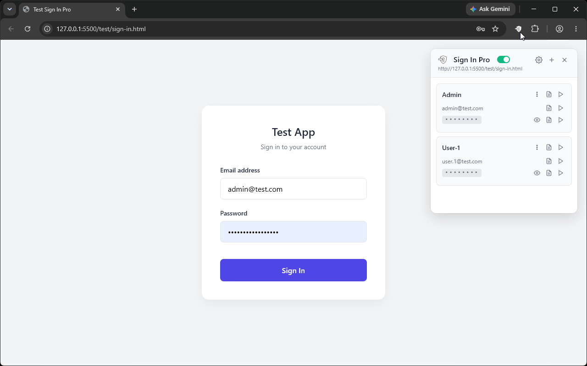
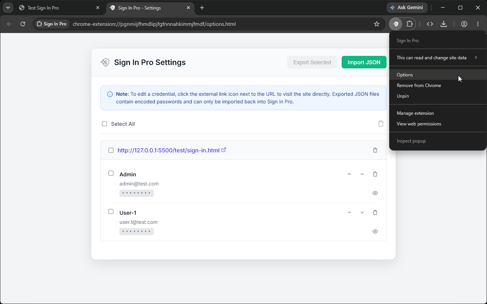

  
  <h1>Sign In Pro</h1>
  
The ultimate in-page Sign In Credentials manager tailored for developers and testers.

---

## 🌟 Overview

**Sign In Pro** is a professional-grade Chrome extension designed to simplify your workflow when testing applications with multiple accounts. It provides a sleek, non-intrusive floating widget right on your webpage, allowing you to quickly manage and auto-fill login credentials without switching tabs or digging through standard password managers.

## ✨ Features

- **🚀 Quick Auto-Fill:** Instantly inject credentials directly into login forms from the floating on-page widget.
- **🎯 Smart DOM Picker:** Visually select username and password input fields on any website to map credentials effortlessly.
- **⚙️ Import & Export:** Easily export your credentials to JSON and import them across different testing environments using the dedicated Options page.
- **🎨 Modern UI:** A beautiful, responsive, and intuitive interface injected directly into the Shadow DOM to avoid styling conflicts.
- **🔒 Local Storage:** Your credentials are saved directly within your browser's local extension storage.

## 📸 Screenshots

### On-Page Widget
Access and auto-fill your credentials instantly through the injected floating widget.
 

### Settings & Management
Manage, export, and import your credentials from the intuitive options dashboard.
 

## 🚀 Installation

Visit the [Chrome Web Store](https://chromewebstore.google.com/search/ABC+Academy) and install the extension.

## 🛠️ Usage

1. Click the **Sign In Pro** extension icon in your Chrome toolbar to toggle the floating widget on any page.
2. Use the widget to add new credentials for the current site.
3. Click on a saved credential to auto-fill the login form.
4. Right-click the extension icon and select **Options** to manage or export your credentials.

## ⚖️ License

Distributed under the MIT License.
